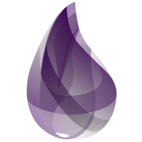

### Hey there! 👋

#### I'm a Software Developer with 1+ years experience, addicted to solve problem.

 <h2 text-align="center">Currently working at</h2>    
 <a href="https://www.stone.com.br/">

</a>
<br>
<br>

<div style="max-width:800px;">

```elixir
 me = %{
    name: "João Victor S. Vieira",
    current_position: "Elixir Developer",
    skills: {:java, :javascript, :css, :elixir, :postgreSQL, :jsp, :phoenix, :bootstrap,
    :html, :svn, :github, :springboot, :github, :ajax, :jquery}
 }

```

</div>

<br>
<div style="display:flex; flex-direction:row;">




</div>
<br>

## **GitHub Statistics**

<div style="display:flex; flex-direction:row; margin-top:15px;">
<a href="https://github.com/jovi47">
  
</a>

<a style="margin-left: 10px;" href="https://github.com/jovi47">
 
</a>
</div>
<br>
<div>
  <a href="https://instagram.com/joaov_47" target="_blank"></a>
  <a href = "mailto:jovi47profissional@gmai.com"></a>
  <a href="https://www.linkedin.com/in/jovi47" target="_blank"></a>   
</div>
